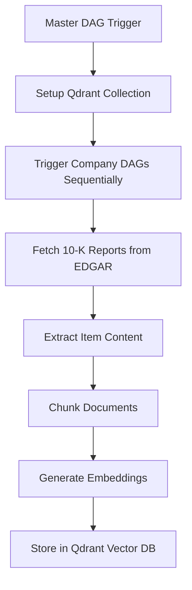

# Finance RAG Data Ingestion Pipeline

A comprehensive data ingestion pipeline built with Apache Airflow that automatically fetches SEC 10-K financial reports, processes them into semantic chunks, generates embeddings, and stores them in a vector database for Retrieval-Augmented Generation (RAG) applications.

## 🏗️ Architecture Overview

The pipeline consists of three main components:

1. **Master DAG** (`master_ingestion_dag.py`) - Orchestrates the entire process
2. **Individual Company DAGs** (`data_ingestion_dag.py`) - Processes reports for specific companies  
3. **Utility Functions** (`utils.py`) - Core processing logic and database operations

### Pipeline Flow



## 🚀 Features

- **Automated SEC Filing Retrieval**: Fetches 10-K reports from EDGAR API
- **Intelligent Document Processing**: Extracts and chunks financial document items
- **Vector Embeddings**: Generates embeddings using fine-tuned financial models
- **Vector Database Storage**: Stores processed data in Qdrant for efficient retrieval
- **Multi-Company Support**: Processes multiple companies across different sectors
- **Robust Error Handling**: Continues processing even if individual companies fail
- **Scalable Architecture**: Built on Apache Airflow for production deployment

## 📋 Prerequisites

### Required Services

- **Docker and Docker Compose** - For running Airflow locally
- **Python 3.8+** - For local development
- **Qdrant Vector Database** - Vector storage for embeddings
- **Azure ML Endpoint** (recommended) - For embedding generation

### Optional: Deploy Azure ML Embedding Endpoint

For optimal performance and scalability, it's recommended to deploy the GTE Finance embedding model on Azure Machine Learning before running the data ingestion pipeline.

#### Quick Setup for Azure ML Endpoint

1. **Switch to the model deployment branch**:
   ```bash
   git checkout model-deployment
   # or if cloning fresh:
   git clone -b data-ingestion-pipeline https://github.com/Chandi713/Finance-RAG.git
   cd Finance-RAG
   ```

2. **Deploy the embedding model**:
   - Follow the detailed guide in the `data-ingestion-pipeline` branch
   - The branch contains a complete setup script and deployment notebook
   - Deployment includes the pre-trained GTE Finance model optimized for financial text

3. **Key benefits of Azure ML endpoint**:
   - **Scalability**: Handle large batch processing efficiently
   - **Performance**: Optimized inference with managed compute
   - **Reliability**: High availability with 2-instance deployment
   - **Cost-effective**: Pay-per-use model for production workloads

4. **What you'll get**:
   - Managed online endpoint URL
   - Authentication key for API access
   - 768-dimensional embeddings optimized for financial documents
   - Support for up to 2000 token sequences

#### Fallback Option

If you don't deploy the Azure ML endpoint, the pipeline will automatically fall back to using a local Sentence Transformer model. However, this may be slower for large-scale processing and require more local compute resources.

---

## 🛠️ Installation & Setup

### 1. Clone the Repository

```bash
git clone https://github.com/Chandi713/Finance-RAG.git checkout -b "data-ingestion-pipeline"
cd checkout
```

### 2. Environment Configuration

Create a `.env` file in the root directory with the following variables:

```bash
# Qdrant Configuration (Required)
QDRANT_ENDPOINT=https://your-qdrant-instance.qdrant.io
QDRANT_API_KEY=your_qdrant_api_key
COLLECTION_NAME=Finance_RAG_DB

# Azure ML Endpoint Configuration (Recommended)
# Get these values after deploying the embedding model using the model-deployment branch
AZURE_ENDPOINT=https://your-azure-ml-endpoint.azureml.ms/score
AZURE_API_KEY=your_azure_api_key

# Airflow Configuration
AIRFLOW_UID=50000
AIRFLOW_GID=0
```

#### Environment Variables Explained

| Variable | Description | Required | Source |
|----------|-------------|----------|---------|
| `QDRANT_ENDPOINT` | Qdrant database URL | ✅ Yes | Qdrant Cloud or self-hosted |
| `QDRANT_API_KEY` | Qdrant authentication key | ✅ Yes | Qdrant dashboard |
| `COLLECTION_NAME` | Vector collection name | ✅ Yes | Choose any name (e.g., "Finance_RAG_DB") |
| `AZURE_ENDPOINT` | Azure ML endpoint URL | 🔶 Optional | Deployed from `model-deployment` branch |
| `AZURE_API_KEY` | Azure ML API key | 🔶 Optional | Azure ML Studio > Endpoints |

> **💡 Tip**: If you don't set up the Azure ML endpoint, the pipeline will automatically use a local Sentence Transformer model, but processing will be slower for large datasets.

### 3. Project Structure

```
Finance-RAG/
├── .astro/                           # Astronomer configuration
├── dags/
│   ├── data_ingestion_dag.py         # Individual company processing DAG
│   ├── master_ingestion_dag.py       # Master orchestration DAG
│   ├── trigger_script.py             # Manual DAG trigger script
│   └── utils.py                      # Core utility functions
├── tests/dags/                       # DAG tests
├── .dockerignore                     # Docker ignore file
├── .gitignore                       # Git ignore file
├── Dockerfile                        # Custom Airflow image (Astronomer runtime)
├── README.md                        # This file
├── docker-compose.yml               # Docker Compose for local development
├── packages.txt                     # System packages for Dockerfile
└── requirements.txt                 # Python dependencies
```

### 4. Docker Setup

#### Using Astronomer CLI

This project is already set up as an Astronomer project, so you can use the Astronomer CLI directly:

1. **Install Astronomer CLI**:
   Follow the official installation guide: https://www.astronomer.io/docs/astro/cli/install-cli/?tab=mac#install-the-astro-cli
   
   Or use the quick install command:
   ```bash
   curl -sSL install.astronomer.io | sudo bash -s
   ```

2. **Navigate to project directory**:
   ```bash
   cd Finance-RAG
   ```

3. **Create environment file**:
   ```bash
   cp .env.example .env  # Create from template
   # Edit .env with your configuration
   ```

4. **Start the Astronomer development environment**:
   ```bash
   astro dev start
   ```

### 5. Access the Application

- **Airflow Web UI**: http://localhost:8080
- **Default Credentials**: 
  - Username: `admin`
  - Password: `admin`

## 🎯 Usage

### Automatic Execution

1. **Access Airflow Web UI** at http://localhost:8080
2. **Find the `master_ingestion_dag`** in the DAGs list
3. **Click the Play button (▶️)** to trigger the pipeline
4. **Monitor progress** in the Grid view

### Manual Trigger via Script

The trigger script is located in the `dags/` directory:

```bash
python dags/trigger_script.py \
  --airflow-url http://localhost:8080 \
  --username admin \
  --password admin
```

### Custom Company Processing

To process specific companies, modify the `COMPANIES_TO_PROCESS` list in `master_ingestion_dag.py`:

```python
COMPANIES_TO_PROCESS = ["AAPL", "MSFT", "GOOGL"]  # Add your desired tickers
```

## 📊 Supported Companies

The pipeline currently has list of companies across multiple sectors:

- **Technology**: Apple (AAPL), Microsoft (MSFT), Google (GOOGL), Meta (META), NVIDIA (NVDA)
- **Healthcare**: UnitedHealth (UNH), Pfizer (PFE), Johnson & Johnson (JNJ), AbbVie (ABBV), Eli Lilly (LLY)
- **Finance**: Capital One (COF), Bank of America (BAC), Wells Fargo (WFC), Morgan Stanley (MS)
- **Manufacturing**: Caterpillar (CAT), General Electric (GE), 3M (MMM), Honeywell (HON)
- **Defense**: Lockheed Martin (LMT), Northrop Grumman (NOC), Raytheon (RTX), General Dynamics (GD)

## 🔧 Configuration

### Airflow Variables

Set these in the Airflow Web UI under Admin > Variables:

| Variable | Description | Required |
|----------|-------------|----------|
| `company_ticker` | Default company ticker to process | Optional (Default: `MSFT`) |

### Environment Variables

| Variable | Description | Required | How to Get |
|----------|-------------|----------|------------|
| `QDRANT_ENDPOINT` | Qdrant database URL | Yes | Qdrant Cloud dashboard |
| `QDRANT_API_KEY` | Qdrant API key | Yes | Qdrant Cloud dashboard |
| `COLLECTION_NAME` | Vector collection name | Yes | Choose any name |
| `AZURE_ENDPOINT` | Azure ML endpoint URL | No* | Deploy using `model-deployment` branch |
| `AZURE_API_KEY` | Azure ML API key | No* | Azure ML Studio |

*Required for optimal performance, falls back to local model if not provided

## 🐛 Troubleshooting

### Common Issues

1. **DAG Import Errors**:
   ```bash
   # Check DAG syntax
   python -m py_compile dags/master_ingestion_dag.py
   ```

2. **Database Connection Issues**:
   ```bash
   # Verify Qdrant connection
   docker-compose logs airflow-scheduler | grep -i qdrant
   ```

3. **Memory Issues**:
   ```bash
   # Increase Docker memory allocation to 8GB+
   # Restart Docker and containers
   docker-compose restart
   ```

4. **EDGAR API Rate Limiting**:
   - The pipeline includes delays between requests
   - For heavy usage, consider implementing exponential backoff

### Debug Mode

Enable debug logging by setting in `docker-compose.yml`:

```yaml
environment:
  AIRFLOW__LOGGING__LOGGING_LEVEL: DEBUG
```

## 📈 Performance Optimization

### Scaling Tips

1. **Batch Size**: Adjust `batch_size` parameter in `store_to_database()` function
2. **Concurrent Tasks**: Modify `max_active_runs` in DAG configuration
3. **Memory**: Increase Docker memory allocation for large datasets
4. **Parallelization**: Consider using CeleryExecutor for distributed processing

### Monitoring

- **Airflow Logs**: Check individual task logs for detailed error information
- **Qdrant Metrics**: Monitor vector database performance and storage
- **Resource Usage**: Monitor Docker container resources

## 🤝 Contributing

1. Fork the repository
2. Create a feature branch (`git checkout -b feature/new-feature`)
3. Commit changes (`git commit -am 'Add new feature'`)
4. Push to branch (`git push origin feature/new-feature`)
5. Create a Pull Requests.

**Built with ❤️ using Apache Airflow, Qdrant, and Python**
